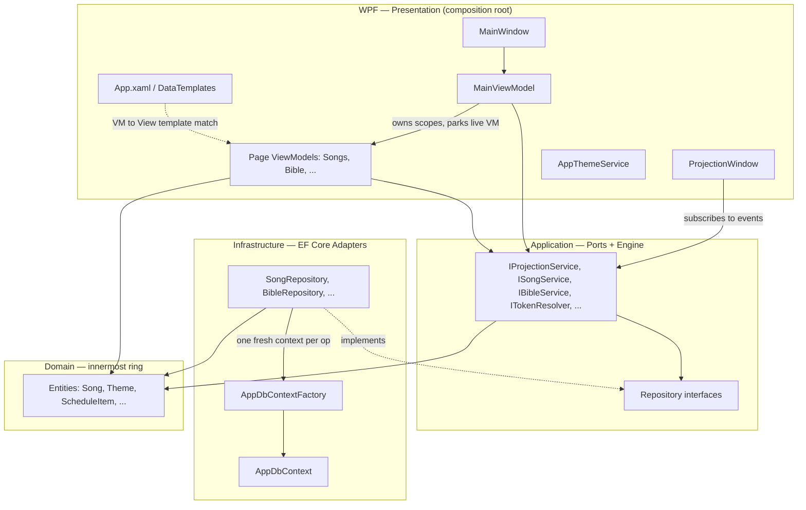
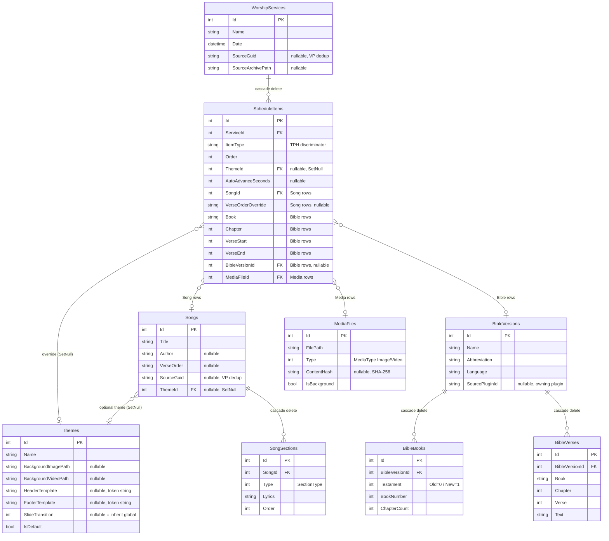

# OpenAdoration — Architecture & Developer Reference

> Last updated: 2026-06-19 (architecture unchanged in v2.0.1)
> Status: **v2.0.1 current** — v1.0 (M0–M7) shipped 2026-06-01; v2.0 (M8–M14) shipped as `v2.0.0`
> (2026-06-19); v2.0.1 patch (Stage View video-bg + i18n fix) released 2026-06-20.
> See `ROADMAP.md` / `CHANGELOG.md`.
>
> **Scope note:** the core architecture below (layers, DI, projection engine, theme resolution, DB,
> Bible import) is current. Subsystems added after §3's diagrams — v1.0 finishing batch **and** the
> v2.0 line — are summarised in [§12](#12-subsystems-added-after-the-core-diagrams); for exhaustive
> detail see `CLAUDE.md`.

---

## 1. Executive Summary

OpenAdoration is a **Windows desktop worship-presentation application** — a free, open-source alternative to EasyWorship. A single operator runs it during a church service to control what is shown on a projector screen.

Core loop:
1. Operator builds a **song library** and a **service schedule** before the meeting.
2. On the day, the operator opens the app, navigates through the schedule, and **sends slides to the projector** (a secondary monitor) in real time.
3. Slides are generated on the fly from the stored content — nothing is pre-rendered.

The app is **fully offline**. There are no network calls, no accounts, no cloud sync. Everything lives in a single SQLite file on the operator's machine.

---

## 2. Architecture

### 2.1 Layer Diagram

```
┌─────────────────────────────────────────────────────────────┐
│                     OpenAdoration.WPF                       │
│                                                             │
│  App.xaml.cs  ──  DI composition root, startup/shutdown    │
│  MainWindow   ──  Shell: sidebar nav + projection bar       │
│  ProjectionWindow ─ Full-screen secondary-monitor output    │
│                                                             │
│  Views/           UserControls, one per feature            │
│  ViewModels/      ObservableObject + RelayCommand (MVVM)   │
│  Converters/      IValueConverter implementations          │
│  Helpers/         ScreenHelper, BibleImport parsers        │
│  Styles/          Colors.{Dark,Light}.xaml, Base.xaml      │
└─────────────────────┬───────────────────────────────────────┘
                      │  interfaces only (no concrete refs)
┌─────────────────────▼───────────────────────────────────────┐
│                  OpenAdoration.Application                   │
│                                                             │
│  Services/     ISongService, IBibleService, IThemeService,  │
│                IMediaService, IWorshipServiceService,        │
│                IProjectionService  (+ implementations)      │
│                                                             │
│  Repositories/ ISongRepository, IBibleRepository, ...       │
│                (interfaces only — Infrastructure implements) │
│                                                             │
│  Common/       Slide, SlideType  (runtime DTO, never stored)│
└─────────────────────┬───────────────────────────────────────┘
                      │
┌─────────────────────▼───────────────────────────────────────┐
│                 OpenAdoration.Infrastructure                  │
│                                                             │
│  Persistence/  AppDbContext, IDbContextFactory<AppDbContext> │
│  Configurations/ Fluent API entity configs (one per entity) │
│  Repositories/ Concrete EF Core implementations            │
│  Logging/      LoggingConfiguration (Serilog setup)         │
│  Extensions/   AddInfrastructure(), InitialiseDatabaseAsync()│
│  Migrations/   EF Core migration files                      │
└─────────────────────┬───────────────────────────────────────┘
                      │
┌─────────────────────▼───────────────────────────────────────┐
│                   OpenAdoration.Domain                       │
│                                                             │
│  Entities/     Song, SongSection, BibleVerse, Theme, ...    │
│  Enums/        SectionType, MediaType, Testament            │
│  Common/       BaseEntity (Id, CreatedAt, UpdatedAt)        │
└─────────────────────────────────────────────────────────────┘
```

### 2.2 Dependency Rule

```
WPF  →  Application  →  Domain
         ↑
Infrastructure  →  Application  →  Domain
```

- **WPF is the composition root** — it references both Application (for service interfaces) and Infrastructure (solely to call `AddInfrastructure()` in `App.xaml.cs`). This is the only permitted Infrastructure reference from WPF; all other WPF code must go through Application interfaces.
- Infrastructure references Application but never WPF.
- Domain references nothing — it is the innermost ring.

### 2.2b Dependency & DI Map (Mermaid)

Clean-architecture rings + the main DI wiring the `LayerDependencyTests` (G28) enforce. Arrows point
**inward** only; WPF is the sole project allowed to see Infrastructure (and only to compose it).



**DI lifetimes at a glance:** singletons — `MainViewModel`, `MainWindow`, `ProjectionWindow`,
`IProjectionService`, `ITokenResolver`, `IAppSettingsService`, `ISongLibraryNotifier`; transients —
page VMs; scoped — all services + repositories; `IDbContextFactory` is a singleton that creates
scoped contexts. Page VMs are resolved from `MainViewModel`'s per-navigation scope (G11).

### 2.3 Key Design Decisions

| Decision | Choice | Reason |
|---|---|---|
| UI framework | WPF (.NET 10); runtime Light/Dark via `DynamicResource` (G27) | Rich desktop controls, proven multi-monitor support |
| DB | SQLite via EF Core 10 | Zero-install, single file, offline-first |
| MVVM | CommunityToolkit.Mvvm 8 | Source-generated commands/properties, no boilerplate |
| Video | FFmpeg via FFME (FFME.Windows) | Plays any codec incl. HEVC without OS codecs; also frame-grabs thumbnails |
| i18n | resx + `{loc:Loc}` + live `TranslationSource` (en/es) | Operator-switchable UI language without restart |
| Navigation | ContentControl + DataTemplates | No navigation framework needed; ViewModel-first |
| DbContext lifetime | `IDbContextFactory` (one ctx per operation) | Avoids long-lived tracking bugs, safe in async code |
| Projection | Singleton `ProjectionService` | Owns state machine for the app's lifetime |
| Theme resolution | `IServiceScopeFactory` + per-session cache | Scoped service resolved in async context without leaking |
| Bible FTS | SQLite FTS5 virtual table | Fast full-text search over 31k+ verses without a server |
| Media storage | Copy-on-import to `%LocalAppData%\OpenAdoration\Media\` | Files survive source deletion; path in DB is always valid |
| Logging | Serilog (rolling daily file + debug sink) | Structured, queryable, non-blocking |
| Multi-monitor | `System.Windows.Forms.Screen` | Only API that reliably enumerates physical screens in WPF |

---

## 3. Data Flows

### 3.1 Startup

```
App.OnStartup()
  │
  ├─ LoggingConfiguration.Configure(logDir)   ← Serilog configured first
  │
  ├─ Host.CreateDefaultBuilder()
  │    ├─ ConfigureLogging → UseOpenAdorationSerilog()
  │    └─ ConfigureServices → AddInfrastructure(dbPath)
  │                           RegisterViewModels()
  │                           RegisterWindows()
  │
  ├─ services.InitialiseDatabaseAsync()        ← MigrateAsync() — no-op if up to date
  │    └─ on failure → MessageBox + Shutdown(1)
  │
  └─ Show MainWindow
```

### 3.2 Navigation Flow

```
Operator clicks "🎵 Songs" sidebar button
  │
  ▼
MainViewModel.NavigateToSongsCommand
  │  Creates new IServiceScope
  │  GetRequiredService<SongsViewModel>()   ← Transient: new VM each time
  │  Disposes previous scope
  │
  ▼
MainViewModel.CurrentView = SongsViewModel
  │
  ▼
ContentControl in MainWindow.xaml
  │  DataTemplate lookup: SongsViewModel → SongsView (UserControl)
  │
  ▼
SongsView.OnLoaded()
  │  vm.LoadCommand.Execute(null)
  │
  ▼
SongsViewModel.LoadAsync()
  │  ISongService.GetAllAsync()
  │  ISongRepository.GetAllAsync()
  │  AppDbContext (created, queried, disposed)
  │
  ▼
Songs ObservableCollection populated → UI renders list
```

### 3.3 Projection Flow

```
Operator clicks "▶ Project" on a song row
  │
  ▼
SongsViewModel.ProjectSongCommand(song)
  │  ISongService.GenerateSlides(song)  → one Slide per ordered SongSection
  │
  ▼
IProjectionService.LoadSlides(slides, contextLabel)   ← Singleton
  │  _isProjecting = true
  │  _currentIndex = 0
  │  RaiseSlideChanged(slides[0])      ← subscriber exceptions caught+logged
  │  RaiseProjectionStateChanged(true)
  │
  ├──▶ MainViewModel.OnSlideChanged()
  │      Updates "PROJECTING" bar in MainWindow
  │
  └──▶ ProjectionWindow.OnSlideChanged()    ← async void
         seq = Interlocked.Increment(ref _renderSequence)
         resolvedTheme = await ResolveThemeAsync(slide.ThemeId)
         if (seq != _renderSequence) return;   ← stale-slide guard
         Dispatcher.InvokeAsync(() =>
           _activeTheme = resolvedTheme
           RenderSlide(slide))
             │
             ├─ SlideType.Song/Bible → ShowText()   → TextViewbox visible
             ├─ SlideType.Media (image) → ShowImageMedia() → BackgroundImage visible
             ├─ SlideType.Media (video) → ShowVideoMedia() → ContentVideo.Play()
             └─ SlideType.Blank → ShowBlankOverlay() → HideAllLayers() + BlankOverlay visible
                                                        (opaque black fill covers all layers,
                                                         incl. theme bg → fully black screen)
```

### 3.4 Theme Resolution (per slide)

Two stages. **Upstream** (`ThemeCascade`, Application/Common) picks *which* `themeId` a slide
carries; **downstream** (`ProjectionWindow.ResolveThemeAsync`) turns that id into a `Theme`.

`ThemeCascade` runs at every slide-generation call site (standalone song/Bible/media projection
**and** live service items), most-specific wins:

```
ScheduleItem.ThemeId  ??  content's own ThemeId (Song.ThemeId)  ??  per-content-type default
   (Default{Song,Scripture,Media}ThemeId in settings.json)  →  null
```

A `null` result means "no explicit theme" and flows into the per-slide resolver below, whose
`themeId null` branch supplies the app-wide default — so the app-default rung is **not** duplicated.

```
ProjectionWindow.ResolveThemeAsync(themeId?)
  │
  ├─ themeId has value → check _themeCache[themeId]
  │    hit  → return cached Theme (no DB call)
  │    miss → CreateAsyncScope() → IThemeService.GetByIdAsync(themeId)
  │             fallback to GetDefaultAsync() if not found
  │             store in _themeCache[themeId]
  │
  └─ themeId null → check _defaultTheme
       not null → return _defaultTheme
       null     → CreateAsyncScope() → IThemeService.GetDefaultAsync()
                   store in _defaultTheme (reference assignment — atomic)

Cache invalidation: OnThemeChanged() clears both _defaultTheme and _themeCache,
then calls _projectionService.RefreshCurrentSlide() to re-render with fresh theme.
```

### 3.5 Theme Change Propagation

```
Operator saves a theme in AddEditThemeViewModel
  │
  ▼
IProjectionService.NotifyThemeChanged()
  │  Fires ThemeChanged event (with per-subscriber exception guard)
  │
  ▼
ProjectionWindow.OnThemeChanged()
  │  Dispatcher.InvokeAsync(() =>
  │    _defaultTheme = null
  │    _themeCache.Clear()
  │    _projectionService.RefreshCurrentSlide())
  │
  ▼
ProjectionService.RefreshCurrentSlide()
  │  if (!_isProjecting) return
  │  RaiseSlideChanged(CurrentSlide)  ← triggers full re-render with fresh theme
```

### 3.5b App-Chrome Appearance (Light/Dark — G27)

Distinct from projection-content theming above: this is the **operator UI** palette, not the
projected output (projection is driven solely by the `Theme` entity and is unaffected).

```
Colors.Dark.xaml / Colors.Light.xaml   ← identical keys, different values
   (10 base + 4 semantic: Danger/Success surfaces, Success text/border)
App.xaml merges Colors.Dark.xaml as the build-time default
All views/styles reference brushes via {DynamicResource} (not StaticResource)
   │
   ▼
IAppThemeService.Apply(AppearanceMode)            (WPF singleton)
   │  builds Colors.{mode}.xaml dict, finds the merged dict containing
   │  "PrimaryBrush", replaces it in-place → DynamicResource consumers re-resolve live
   │
   ├─ App.OnStartup: Apply(settings.Appearance) before MainWindow.Show()
   └─ Settings→General toggle: Apply(mode) live (no restart) + persist AppSettings.Appearance
```

Persisted as `AppSettings.Appearance` (enum Dark=0 / Light=1, default Dark; serialized as int).
The slide-preview boxes in StageView and the ProjectionWindow keep fixed dark colours on purpose —
they mirror the projected output, not the chrome.

### 3.6 Bible Full-Chapter Projection

```
Operator clicks a verse in the Bible browser
  │
  ▼
BibleViewModel.ProjectCurrentSelection()
  │  selected = single verse, chapter mode (not keyword search)
  │
  ▼
  slides = _chapterVerses.Select(v => _bibleService.GenerateSlide([v])).ToArray()
  label  = "John 3"
  startIdx = index of selected verse in chapter list
  │
  ▼
IProjectionService.LoadSlides(slides, label)   ← all verses as individual slides
IProjectionService.GoTo(startIdx)              ← jump to clicked verse
  │
  ▼
Main-window ◀/▶ now navigates between all verses in the chapter
  │
  ▼
ProjectionService.SlideChanged → BibleViewModel.OnProjectionSlideChanged()
  │  Syncs verse highlight + preview pane as operator navigates
```

### 3.7 Song Save Flow

```
Operator fills in title + sections, clicks "Save Song"
  │
  ▼
AddEditSongViewModel.SaveCommand
  │  BuildEntity() → Song domain object
  │  Saved event raised
  │
  ▼
SongsViewModel.OnSongSaved(song)
  │
  ├─ new → ISongService.CreateAsync(song)
  │           ISongRepository.AddAsync(song)
  │           AppDbContext.SaveChangesAsync()
  │             StampTimestamps() → CreatedAt + UpdatedAt set
  │
  └─ edit → ISongService.UpdateAsync(song)
               ISongRepository.UpdateAsync(song)
                 Load existing (tracked)
                 RemoveRange(existing.Sections)   ← replace-all pattern
                 Add new sections with Id=0       ← forces INSERT
                 AppDbContext.SaveChangesAsync()
  │
  ▼
SongsViewModel.LoadAsync()   ← full reload to reflect DB truth
```

---

## 4. Application Service Interfaces

This is a **desktop application** — there are no HTTP endpoints. The Application layer interfaces are the equivalent "API surface."

### `ISongService`
| Method | Description |
|---|---|
| `GetByIdAsync(id)` | Fetch one song with sections |
| `GetAllAsync()` | All songs ordered by title |
| `SearchByTitleAsync(term)` | Case-insensitive title search |
| `CreateAsync(song)` | Persist new song + sections |
| `UpdateAsync(song)` | Replace song metadata + all sections |
| `DeleteAsync(id)` | Hard delete song (cascades to sections) |
| `GenerateSlides(song, themeId?)` | Map ordered sections → `Slide[]` (pure, no I/O) |

### `IBibleService`
| Method | Description |
|---|---|
| `GetVersionsAsync()` | All imported Bible translations |
| `GetBooksAsync(versionId)` | Books in a version, ordered by BookNumber |
| `GetVersesAsync(versionId, book, chapter)` | All verses for a chapter |
| `SearchAsync(versionId, term, maxResults)` | FTS5 full-text search |
| `UpsertVersionVersesAsync(version, books, verses)` | Enrichable import — find-or-create version by abbreviation, insert only missing verses; 1000-row batches + ChangeTracker.Clear() |
| `DeleteVersionAsync(versionId)` | Remove a translation + all its data |
| `GenerateSlide(verses, themeId?)` | Compose verse(s) into a `Slide` (pure) |

### `IProjectionService` (Singleton)
| Method / Event | Description |
|---|---|
| `LoadSlides(slides, contextLabel, contextKey?)` | Start projection with a slide list; `contextKey` tags the source for in-place updates |
| `TryUpdateSlides(contextKey, slides, contextLabel)` | Replace slides in place (clamps index) if projecting and the key matches — live song/service edits, and Stage View's F7 quick style fix |
| `ContextKey` | The `contextKey` of the currently projected content, or null — lets a caller (e.g. `StageViewModel`) re-target `TryUpdateSlides` without already knowing what's on screen |
| `Next()` / `Previous()` / `GoTo(index)` | Advance / go back / jump to a slide |
| `ShowBlank()` | Show black screen without stopping |
| `ShowAnnouncement(text)` / `ClearAnnouncement()` | Blue banner overlay over the current slide (auto-dismiss); not a slide type |
| `ShowLowerThird(text)` / `ClearLowerThird()` | Persistent flush-bottom overlay; stays until cleared |
| `Stop()` | End projection, clear all state |
| `NotifyThemeChanged()` | Fires `ThemeChanged` — triggers cache clear + re-render |
| `RefreshCurrentSlide()` | Re-fires `SlideChanged` with the current slide |
| Events | `SlideChanged(Slide?)`, `ProjectionStateChanged(bool)`, `ThemeChanged`, `AnnouncementChanged`, `LowerThirdChanged` |

### `IThemeService`
| Method | Description |
|---|---|
| `GetAllAsync()` | All themes |
| `GetByIdAsync(id)` | Single theme by ID (returns null if not found) |
| `GetDefaultAsync()` | The active default theme |
| `CreateAsync(theme)` | Add theme |
| `UpdateAsync(theme)` | Update; handles default-flag exclusivity |
| `DeleteAsync(id)` | Rejects if theme is the default |

### `IMediaService`
| Method | Description |
|---|---|
| `GetAllAsync()` | All imported media files |
| `GetByIdAsync(id)` | Single media file by ID |
| `AddAsync(file)` | Persist a new MediaFile record |
| `DeleteAsync(id)` | Remove the DB record (caller removes the file) |
| `GenerateSlide(file, themeId?)` | Create a `Slide` for projection (pure) |

### `IWorshipServiceService`
| Method | Description |
|---|---|
| `GetAllAsync()` | All services |
| `GetWithItemsAsync(serviceId)` | Service with all schedule items (eager-loaded) |
| `CreateAsync(service)` | New service |
| `DeleteAsync(id)` | Delete service + all items |
| `AddSongItemAsync(serviceId, songId, themeId?)` | Add song to schedule |
| `AddBibleItemAsync(serviceId, book, chapter, verseStart, verseEnd, versionId?)` | Add Bible passage |
| `AddMediaItemAsync(serviceId, mediaFileId, themeId?)` | Add media file |
| `RemoveItemAsync(scheduleItemId)` | Remove one item |
| `ReorderItemsAsync(serviceId, orderedIds)` | Persist new item order |

---

## 5. Database

**Engine**: SQLite (file at `%LocalAppData%\OpenAdoration\openadoration.db`)
**ORM**: Entity Framework Core 10, Fluent API configuration
**Migrations**: auto-applied at startup via `MigrateAsync()`

### 5.1 Schema Overview

```
┌──────────────────────────────────────────────────────────────┐
│ Songs                       │ SongSections                   │
│─────────────────────────────│────────────────────────────────│
│ Id             INT  PK      │ Id           INT  PK           │
│ Title          TEXT NOT NULL│ SongId       INT  FK → Songs   │
│ Author         TEXT NULL    │ Type         INT  (SectionType)│
│ Classification TEXT NULL    │ SectionNumber INT              │
│ Copyright      TEXT NULL    │ Lyrics       TEXT NOT NULL     │
│ CcliNumber     TEXT NULL    │ Order        INT  NOT NULL     │
│ VerseOrder     TEXT NULL    │ CreatedAt    DATETIME          │
│ SourceGuid     TEXT NULL    │ UpdatedAt    DATETIME          │
│  (VP dedup key)             │                                │
│ ThemeId  INT? FK→Themes     │                                │
│           (SetNull)         │                                │
│ CreatedAt      DATETIME     │                                │
│ UpdatedAt      DATETIME     │                                │
│  1 Song ──< many Sections (Cascade delete)                   │
└──────────────────────────────────────────────────────────────┘

┌──────────────────────────────────────────────────────────────┐
│ Themes                                                       │
│──────────────────────────────────────────────────────────────│
│ Id                   INT   PK                                │
│ Name                 TEXT  NOT NULL                          │
│ FontFamily           TEXT  NOT NULL                          │
│ FontSize             INT   NOT NULL                          │
│ FontColor            TEXT  NOT NULL  (hex, e.g. #FFFFFF)     │
│ BackgroundColor      TEXT  NOT NULL  (hex)                   │
│ BackgroundImagePath  TEXT  NULL                              │
│ BackgroundVideoPath  TEXT  NULL                              │
│ TextAlignment        TEXT  NOT NULL  default "Center"        │
│ HeaderTemplate       TEXT  NULL  (token string, e.g. [SongTitle]) │
│ FooterTemplate       TEXT  NULL                              │
│ SlideTransition      INT   NULL  (SlideTransitionKind enum; │
│                              null = use global setting)      │
│ IsDefault            BOOL  NOT NULL                          │
│ CreatedAt / UpdatedAt DATETIME                               │
│                                                              │
│  Seeded: Id=1, black bg, white 48pt Arial, IsDefault=true   │
└──────────────────────────────────────────────────────────────┘

┌──────────────────────────────────────────────────────────────┐
│ BibleVersions   │ BibleBooks            │ BibleVerses        │
│─────────────────│───────────────────────│────────────────────│
│ Id          PK  │ Id           PK       │ Id         PK      │
│ Name            │ BibleVersionId FK     │ BibleVersionId FK  │
│ Abbreviation    │ Name                  │ Book  TEXT         │
│ Language        │ Abbreviation          │ Chapter INT        │
│ CreatedAt/At    │ Testament INT (Old=0) │ Verse  INT         │
│                 │ BookNumber INT        │ Text  TEXT         │
│                 │ ChapterCount INT      │ CreatedAt/At       │
│                 │ CreatedAt/At          │                    │
│  1 Version ──< Books ──< Verses (all cascade on version delete)
│                                                              │
│ BibleVersesFts  (FTS5 virtual table)                         │
│  rowid = BibleVerses.Id                                      │
│  Text UNINDEXED BibleVersionId, tokenize=unicode61           │
└──────────────────────────────────────────────────────────────┘

┌──────────────────────────────────────────────────────────────┐
│ WorshipServices         │ ScheduleItems  (TPH — one table)  │
│─────────────────────────│──────────────────────────────────│
│ Id    INT  PK           │ Id         INT  PK               │
│ Name  TEXT              │ ServiceId  INT  FK→WorshipSvc    │
│ Date  DATETIME          │ ItemType   TEXT  ← discriminator │
│ SourceGuid  TEXT NULL   │ Order      INT  NOT NULL         │
│  (VP dedup key)         │ ThemeId    INT? FK→Themes        │
│ SourceArchivePath       │  (SetNull)                       │
│   TEXT NULL             │ CreatedAt/At                     │
│ CreatedAt/At            │                                  │
│                         │ Song rows:   SongId INT FK       │
│                         │ Bible rows:  Book, Chapter,      │
│                         │   VerseStart, VerseEnd,          │
│                         │   BibleVersionId INT? FK         │
│                         │ Media rows:  MediaFileId INT FK  │
└──────────────────────────────────────────────────────────────┘

┌──────────────────────────────────────────────────────────────┐
│ MediaFiles                                                   │
│──────────────────────────────────────────────────────────────│
│ Id        INT   PK                                           │
│ FileName  TEXT  NOT NULL                                     │
│ FilePath  TEXT  NOT NULL  (absolute path in managed store)   │
│ Type      TEXT  (MediaType enum name: "Image" / "Video")     │
│ ContentHash TEXT NULL  (SHA-256; dedup per category)         │
│ IsBackground BOOL  (exclusive: theme background vs slide media)│
│ CreatedAt / UpdatedAt DATETIME                               │
└──────────────────────────────────────────────────────────────┘
```

### 5.1a Entity-Relationship Diagram (Mermaid)

The same schema as §5.1, as an ERD. Note `ScheduleItems` is **one table for all three item types**
(TPH — `ItemType` discriminates; type-specific FKs/columns are null in the other rows). FTS5 virtual
tables (`BibleVersesFts`, `SongSectionsFts`) shadow `BibleVerses`/`SongSections` and are omitted here.



### 5.2 Applied Migrations

| Migration | What it adds |
|---|---|
| `20260505012006_InitialCreate` | Full schema; seeds default theme |
| `20260512033146_AddSongClassification` | `Classification` column on Songs |
| `20260519003743_AddThemeVideoBackground` | `BackgroundVideoPath` on Themes |
| `20260519005541_AddThemeTextAlignment` | `TextAlignment` column on Themes |
| `20260520041713_AddBibleVersesFts` | `BibleVersesFts` FTS5 virtual table |
| `20260528234215_AddSongVerseOrder` | `VerseOrder` token string on Songs |
| `20260528234224_AddSongSectionsFts` | `SongSectionsFts` FTS5 table for lyrics search |
| `20260529000159_AddThemeHeaderFooter` | `HeaderTemplate` / `FooterTemplate` on Themes |
| `20260529011841_AddSongCopyrightAndCcli` | `Copyright` / `CcliNumber` on Songs |
| `20260529012740_AddScheduleItemAutoAdvance` | `AutoAdvanceSeconds` on ScheduleItems |
| `20260529210146_AddSongScheduleItemVerseOrderOverride` | `VerseOrderOverride` on song schedule items |
| `20260616211931_AddVideoPsalmMigrationFields` | VideoPsalm-migration provenance fields (M12.1) |
| `20260619011133_AddSongThemeId` | `ThemeId` FK (SetNull) + index on Songs — content-level theming (M14.1) |
| `20260619211758_AddThemeSlideTransition` | `SlideTransition` (nullable) on Themes — per-theme transition override (M14.3) |
| `20260623212235_AddBibleVersionSourcePluginId` | `SourcePluginId` on BibleVersions — delete a plugin's Bibles on removal (M13.4) |
| `20260624031508_AddMediaFileIsBackground` | `IsBackground` on MediaFiles + composite `(ContentHash, IsBackground)` index — managed background-media library |

> Note: app **Settings** (church name/CCLI, default auto-advance, verses-per-slide,
> announcement duration, transition ms + kind, **per-content-type default themes**
> `DefaultSongThemeId`/`DefaultScriptureThemeId`/`DefaultMediaThemeId`, **UI language**
> `UiCulture`, and **Light/Dark** `Appearance`) live in `settings.json`, **not** the
> database — no migration.

### 5.3 Table Per Hierarchy — ScheduleItems

All three schedule item types share one `ScheduleItems` table. `ItemType` TEXT (`"Song"` / `"Bible"` / `"Media"`) is the EF Core discriminator. Columns for other types are `NULL` in each row.

### 5.4 Timestamp Handling

`AppDbContext.StampTimestamps()` intercepts every `SaveChanges`:
- `Added` → sets `CreatedAt` + `UpdatedAt` to `DateTime.UtcNow`
- `Modified` → sets only `UpdatedAt`; marks `CreatedAt` as not-modified

Seed data in `ThemeConfiguration` uses a **static** fixed date — never `DateTime.UtcNow`.

### 5.5 Indexes

| Table | Index |
|---|---|
| Songs | `Title` (ordered list + search) |
| ScheduleItems | `(ServiceId, Order)` composite |

---

## 6. Bible Import

### Format Detection (`BibleFormatDispatcher`)

```
.xml  → PeekXmlRoot() → route by root element name
          XMLBIBLE / ZEFANIA / ... → ZefaniaXmlParser
          osis                     → OsisXmlParser   (streaming XmlReader)
          usfx                     → UsfxXmlParser   (streaming XmlReader)

.json → JsonDocument peek
          Array root               → ThiagobodrukJsonParser
          {metadata, verses}       → BibleSuperSearchJsonParser  (checked first)
          {books} arrays-of-arrays → ThiagobodrukJsonParser
          {books} arrays-of-objects→ OpenADorationJsonParser

.zip    → BibleSuperSearchZipParser  (info.json + verses.txt pipe-delimited)
.sqlite → BibleSuperSearchSqliteParser (meta + verses tables)
unknown → sniff: '<' → XML; else → JSON
```

### Book Name Resolution (`OsisBookCatalog`)

Static dictionary of 66 books keyed by OSIS/USFX ID (e.g. `Gen`, `Exod`, `Matt`). Value = `BookInfo(Name, Abbreviation, Number, Testament)`.

- `GetOrFallback(id, fallbackNumber, fallbackName)` — safe for non-standard IDs
- `GetByNumber(int 1–66)` — lazy reverse dict; used by BibleSuperSearch parsers (integer book numbers only)

Parsers that carry localized book names in the file (Zefania, OSIS, USFX, BibleSuperSearch JSON) use those names; parsers with only integer book numbers fall back to English names from the catalog.

### Import Pattern (memory-safe)

```csharp
// BibleRepository.UpsertVersionVersesAsync → InsertMissingVersesAsync
foreach (var batch in verses.Chunk(1000))
{
    context.BibleVerses.AddRange(batch);
    await context.SaveChangesAsync();
    context.ChangeTracker.Clear();   // ← prevents accumulating 31k tracked entities
}
```

---

## 7. Projection Window — Layer Model

`ProjectionWindow.xaml` stacks elements in Z-order (bottom to top):

```
ThemeBackground      ← Rectangle; always visible; theme BackgroundColor fill
ThemeBackgroundImage ← Image; theme BackgroundImagePath; Collapsed if no image
ThemeBackgroundVideo ← MediaElement; IsMuted=True; loops via MediaEnded; Collapsed if no video
BackgroundImage      ← Image; media slides (images); Collapsed otherwise
ContentVideo         ← MediaElement; media slides (videos); plays with audio; Collapsed otherwise
TextViewbox          ← Viewbox+TextBlock; song/Bible text; 3-zone Header/Body/Footer; Collapsed otherwise
BlankOverlay         ← Rectangle (black fill); shown on blank slide — covers all layers
LowerThird           ← persistent flush-bottom banner; shown via ShowLowerThird, stays until cleared
Announcement         ← blue banner overlay; shown via ShowAnnouncement; auto-dismisses
CornerLabel          ← ZIndex=100; song title · section label; top-left; Collapsed if no label
```

Slide changes animate with the configured transition (Cut/Fade/Slide/Zoom; per-theme override falls
back to the global `SlideTransition` setting). The app-chrome Light/Dark theme does **not** affect this
window — projection colours come from the `Theme` entity only.

**Blank slide behaviour**: `ShowBlankOverlay()` calls `HideAllLayers()` then sets `BlankOverlay.Visibility = Visible`. The opaque black fill covers all layers — including theme backgrounds — giving a fully black screen.

**Per-session theme cache**: `_themeCache: ConcurrentDictionary<int,Theme>` + `_defaultTheme: Theme?`. Both are cleared on `ThemeChanged` and on `StopAndHide()` so the next session picks up any edits made between services.

---

## 8. External Dependencies

No runtime network dependencies. All data is local.

### NuGet packages (runtime)

| Package | Version | Purpose |
|---|---|---|
| `Microsoft.Extensions.Hosting` | 10.x | DI container, generic host |
| `Microsoft.EntityFrameworkCore` | 10.x | ORM |
| `Microsoft.EntityFrameworkCore.Sqlite` | 10.x | SQLite provider (SQLitePCLRaw native bundle) |
| `CommunityToolkit.Mvvm` | 8.4.0 | Source-generated MVVM |
| `FFME.Windows` | 4.4.350 | FFmpeg-backed video (any codec, incl. HEVC) + frame-grab thumbnails (FFmpeg.AutoGen) |
| `Extended.Wpf.Toolkit` | 5.0.0 | `xctk:ColorPicker` in theme editor |
| `Serilog` | 4.2.0 | Structured logging core |
| `Serilog.Extensions.Logging` | 9.0.0 | MEL → Serilog bridge |
| `Serilog.Sinks.File` | 6.0.0 | Rolling daily file output |
| `Serilog.Sinks.Debug` | 3.0.0 | IDE debug output sink |

### Build-time only

| Package | Purpose |
|---|---|
| `Microsoft.EntityFrameworkCore.Design` | EF Core CLI (`dotnet ef migrations`) — must be in **both** Infrastructure and WPF `.csproj` |

### Platform dependencies

| Dependency | Why |
|---|---|
| Windows 10+ | WPF requirement |
| .NET 10 Runtime | Target framework |
| `UseWindowsForms=true` | `System.Windows.Forms.Screen.AllScreens` — only reliable multi-monitor API |
| FFmpeg 4.4 LGPL DLLs (in `ffmpeg/`, not git) | FFME playback + thumbnails; fetched/SHA256-verified by `installer/fetch-ffmpeg.ps1`, bundled by the MSI |
| VC++ 2015–2022 runtime | Needed by the FFmpeg DLLs; ships with Win10/11; app warns (non-fatal) at startup if absent |

---

## 9. Key Files

```
OpenAdoration.Domain/
  Entities/
    Song.cs, SongSection.cs
    BibleVersion.cs, BibleBook.cs, BibleVerse.cs
    Theme.cs                          ← FontFamily/Size/Color, BackgroundColor/Image/Video, TextAlignment
    MediaFile.cs                      ← FileName, FilePath, Type (Image/Video)
    WorshipService.cs
    ScheduleItem.cs             ★     ← Abstract base; TPH discriminator
    SongScheduleItem.cs, BibleScheduleItem.cs, MediaScheduleItem.cs
  Enums/
    SectionType.cs              ← Verse,Chorus,PreChorus,Bridge,Intro,Outro,Tag
    MediaType.cs                ← Image=0, Video=1
    Testament.cs                ← Old, New  (NOT OldTestament/NewTestament)

OpenAdoration.Application/
  Common/
    Slide.cs                    ★     ← Runtime projection unit — Content, Type, Label, MediaPath, ThemeId
    SlideType.cs                      ← Song, Bible, Media, Blank
  Services/
    IProjectionService.cs       ★     ← Contract: LoadSlides, Next/Prev/GoTo, Blank, Stop, ThemeChanged
    ProjectionService.cs        ★     ← Singleton engine; per-subscriber exception guard
    ISongService / SongService.cs
    IBibleService / BibleService.cs
    IThemeService / ThemeService.cs
    IMediaService / MediaService.cs
    IWorshipServiceService / WorshipServiceService.cs

OpenAdoration.Infrastructure/
  Persistence/
    AppDbContext.cs             ★     ← StampTimestamps(), ApplyConfigurationsFromAssembly
  Configurations/
    ScheduleItemConfiguration.cs ★   ← TPH discriminator setup
    ThemeConfiguration.cs            ← Seeds default theme with static timestamp (G3)
  Repositories/
    SongRepository.cs           ★     ← UpdateAsync: replace-all-sections pattern
    BibleRepository.cs          ★     ← UpsertVersionVersesAsync: insert-only-missing, 1000-row batches + ChangeTracker.Clear()
    ThemeRepository.cs               ← DeleteAsync rejects default; ClearDefaultFlagAsync
    MediaRepository.cs, WorshipServiceRepository.cs
  Extensions/
    InfrastructureServiceExtensions.cs ★ ← AddInfrastructure(), InitialiseDatabaseAsync()

OpenAdoration.WPF/
  App.xaml / App.xaml.cs       ★     ← DI root; DataTemplate nav map; global converters
  MainWindow.xaml               ★     ← Shell: sidebar + ContentControl + projection bar
  ProjectionWindow.xaml         ★     ← Layer stack (see §7)
  ProjectionWindow.xaml.cs      ★     ← RenderSlide(), ResolveThemeAsync(), Dispatcher.InvokeAsync()
  Helpers/
    ScreenHelper.cs                   ← GetSecondaryScreen(), PositionOnScreen()
    MediaSignatureValidator.cs        ← validates file magic bytes (JPEG/PNG/GIF/BMP/TIFF/WEBP/
                                         MP4/AVI/WMV/MKV) at import time so a renamed or corrupt
                                         file is rejected before it reaches projection
    BibleImport/
      BibleFormatDispatcher.cs  ★     ← Auto-detect format + dispatch to parser
      OsisBookCatalog.cs              ← 66 books; GetOrFallback(); GetByNumber()
      ZefaniaXmlParser.cs, OsisXmlParser.cs, UsfxXmlParser.cs
      ThiagobodrukJsonParser.cs, OpenADorationJsonParser.cs
      BibleSuperSearchJsonParser.cs, BibleSuperSearchZipParser.cs, BibleSuperSearchSqliteParser.cs
  Converters/
    FilePathToImageSourceConverter.cs ← Decodes image at 400px (theme backgrounds, full images)
    IntEqualityConverter.cs           ← IMultiValueConverter; used for chapter/card selected-state highlights
    InverseBoolToVisibilityConverter.cs
    HexColorToBrushConverter.cs, ColorToBrushConverter.cs, TestamentToLabelConverter.cs
  Behaviors/
    ThumbnailImage.cs           ★     ← attached Image.Source: disk cache → shell thumbnail → FFmpeg (bg)
  Helpers/
    ShellThumbnail.cs                 ← IShellItemImageFactory (images + most videos)
    FfmpegThumbnail.cs                ← FFmpeg.AutoGen frame grab (HEVC etc. the OS can't thumbnail)
    ThumbnailCache.cs                 ← on-disk PNG cache under {OA_DATA}/thumbcache
    MediaEngine.cs                    ← loads FFmpeg shared libs at startup for FFME
  Services/ (WPF)
    IAppThemeService / AppThemeService.cs ← runtime Light/Dark palette swap (G27)
    LocalizationService.cs            ← applies UiCulture; backs {loc:Loc} / TranslationSource
    IBibleImportService / BibleImportService.cs ← wraps BibleFormatDispatcher with Progress/Total/
                                         StatusMessage + StateChanged/ImportCompleted/ImportFailed
                                         events; runs import on a background thread
    ISongLibraryNotifier / SongLibraryNotifier.cs ★ ← singleton cross-scope signal: song editor
                                         raises NotifySongSaved(id); live service schedule
                                         re-fetches and re-renders that song (G22)
  ViewModels/
    BaseViewModel.cs                  ← IsBusy, ErrorMessage, HasError, SetError(), ClearError()
    MainViewModel.cs            ★     ← Scope-per-navigation, projection controls, state sync
    SongsViewModel.cs           ★     ← CRUD + search + projection
    AddEditSongViewModel.cs     ★     ← Section management; Saved/Cancelled events
    SongSectionViewModel.cs           ← Per-section: type, lyrics, move/delete events
    BibleViewModel.cs           ★     ← Version/book/chapter cascade; verse picker; import; FTS search
    BibleVerseCheckItem.cs            ← Observable verse item for Bible browser (IsChecked)
    BibleVersePickerItem.cs           ← Observable verse item for service schedule picker (IsInRange)
    AddEditThemeViewModel.cs    ★     ← BackgroundType enum; color pickers; font/alignment; live preview
    ThemeViewModel.cs                 ← Theme CRUD + set-default
    MediaViewModel.cs           ★     ← Import (copy-on-import); thumbnail cards; project; delete
    ServiceScheduleViewModel.cs ★     ← Builder + live mode + on-the-fly queue editing
    ScheduleItemViewModel.cs          ← Per-item: TypeIcon, DisplayTitle, move/delete/select events
  Views/
    SongsView.xaml              ★     ← List ↔ edit panel toggle
    AddEditSongView.xaml        ★     ← Title/Author + section list + type buttons
    BibleView.xaml              ★     ← 3-column browser + reference bar + verse list + FTS
    AddEditThemeView.xaml             ← Theme form + live preview rectangle
    ThemeView.xaml                    ← Theme list
    MediaView.xaml              ★     ← Import toolbar + wrap grid of media cards
    ServiceScheduleView.xaml    ★     ← Service list / builder / live mode (3 panels)
  Styles/
    Colors.Dark.xaml / Colors.Light.xaml ← palette per appearance (same keys); swapped at runtime
    Base.xaml                   ★     ← All control styles (Button, TextBox, ComboBox, Cards, etc.)

OpenAdoration.Tests.Infrastructure/
  BibleImport/
    BibleParserTests.cs         ← 8-format tests + ZIP guards, via BibleFormatDispatcher
    Fixtures/                   ← Minimal XML/JSON/ZIP/SQLite fixtures
  SongImport/
    SongParserTests.cs          ← OpenLyrics / OpenSong / ChordPro / plain-text via SongFormatDispatcher
    Fixtures/                   ← Minimal song fixtures
  Architecture/
    LayerDependencyTests.cs     ← NetArchTest layer-boundary enforcement (G28)
  (70/70 tests total — incl. theme cascade, VideoPsalm, en/es resx parity)

★ = highest-leverage files; start here when debugging
```

---

## 10. Common Gotchas

### G1 — `UseWindowsForms=true` causes type ambiguity
`UseWindowsForms=true` pulls `System.Windows.Forms` into scope. Always fully-qualify:
```csharp
public partial class MyView : System.Windows.Controls.UserControl { }
System.Windows.MessageBox.Show(...);
Microsoft.Win32.OpenFileDialog   // NOT System.Windows.Forms.OpenFileDialog
System.Windows.Media.Color       // NOT System.Drawing.Color
```

### G3 — Never `DateTime.UtcNow` in seed data
`HasData()` seeds with a `static readonly` fixed date. `DateTime.UtcNow` changes on every run and causes spurious migrations.

### G4 — `IsBusy` guard in `LoadAsync`
`LoadAsync` opens with `if (IsBusy) return;`. Never set `IsBusy = true` from a caller that then calls `LoadAsync` — the load silently does nothing.

### G7 — Bible import batch pattern
`BibleRepository.UpsertVersionVersesAsync` inserts in batches of 1000 + `ChangeTracker.Clear()`. Do not remove — a full Bible is ~31k verses.

### G8 — DataTemplate required for every navigated ViewModel
`ContentControl` resolves views via `DataTemplate` in `App.xaml`. Missing template = blank content with no error.

### G9 — `ProjectionWindow` events must be unsubscribed
`OnClosed()` must unsubscribe all `IProjectionService` events. Without this, the singleton holds a reference to the dead window.

### G10 — WPF dark-theme `ComboBoxItem` visibility
`FieldComboBox` has a full `ControlTemplate` on `ItemContainerStyle`. Do not simplify — without it, dropdown items are invisible on dark backgrounds.

### G11 — Scope-per-navigation is mandatory
`MainViewModel._currentScope` is disposed and replaced on every `NavigateTo<T>()`. Never resolve page-level ViewModels from the root `IServiceProvider`.

### G14 — `Testament` enum values are `Old` / `New`
`Testament.OldTestament` does not exist — it is `Testament.Old`. This causes a compile error, not a runtime error.

### G16 — `BibleViewModel.SelectedChapter` uses 0 as sentinel
`SelectedChapter` is `int`, not `int?`. The collection contains values 1..N. 0 = nothing selected. Guard: `if (value > 0) LoadVersesAsync()`.

### G17 — `AlignToggleButton.IsChecked` must be `Mode=OneWay`
`TwoWay` would overwrite the VM property with a `bool` instead of firing `SetAlignmentCommand` — binding type mismatch at runtime.

### G18 — `Run.Text` on read-only properties must be `Mode=OneWay`
`<Run Text="{Binding Count, Mode=OneWay}"/>` — `Run.Text` defaults to TwoWay; source-generated properties are read-only and cause a runtime BindingExpression error without `Mode=OneWay`.

---

## 11. Common Operations

### First-time setup
```bash
git clone https://github.com/g0elles/OpenAdoration.git
cd OpenAdoration
dotnet tool install --global dotnet-ef   # once per machine
dotnet build
dotnet run --project OpenAdoration.WPF   # DB created automatically
```

### Add an EF Core migration
```bash
dotnet ef migrations add <MigrationName> \
  --project OpenAdoration.Infrastructure \
  --startup-project OpenAdoration.WPF
# Applied automatically on next launch via MigrateAsync()
```

### Reset the database
```powershell
Remove-Item "$env:LOCALAPPDATA\OpenAdoration\openadoration.db" -Force
# Next launch recreates from migrations + seed data
```

### Read logs
```powershell
# Live tail:
Get-Content "$env:LOCALAPPDATA\OpenAdoration\logs\openadoration-$(Get-Date -Format yyyyMMdd).log" -Wait -Tail 50
```

### Run tests
```bash
dotnet test OpenAdoration.Tests.Infrastructure
# Expected: 70/70 pass — Bible parsers (Zefania, OSIS, USFX, thiagobodruk /
#   OpenAdoration / BibleSuperSearch JSON / ZIP / SQLite + ZIP guards + sanity check),
#   song import (OpenLyrics, OpenSong, ChordPro, plain text), VideoPsalm agenda + DRM
#   detector, theme cascade, layer boundaries (NetArchTest), en/es resx parity
```

### Debug projection issues
1. `[INF] ProjectionService: Loading N slide(s)` — confirms `LoadSlides` called
2. `[INF] ProjectionService: Projection started` — confirms state entered
3. Nothing on screen → look for `[ERR]` in `ProjectionWindow` — exceptions are caught and logged
4. Wrong screen → `[WRN] No secondary screen detected` → floating preview mode

### Feature status

| Feature | Domain | Service | Repo | ViewModel | View |
|---|---|---|---|---|---|
| Songs | ✅ | ✅ | ✅ | ✅ | ✅ |
| Bible | ✅ | ✅ | ✅ | ✅ | ✅ |
| Themes (+ content cascade, per-theme transition) | ✅ | ✅ | ✅ | ✅ | ✅ |
| Service Schedule (+ drag-reorder, VideoPsalm import) | ✅ | ✅ | ✅ | ✅ | ✅ |
| Media (+ thumbnails, transport) | ✅ | ✅ | ✅ | ✅ | ✅ |
| Projection engine (+ announcements, lower-thirds, transitions) | — | ✅ | — | ✅ | ✅ |
| Stage View | — | ✅ | — | ✅ | ✅ |
| Internationalization (en/es) | — | ✅ | — | — | ✅ |
| App appearance (Light/Dark, G27) | — | ✅ | — | ✅ | ✅ |
| Backup/restore · auto-update | — | ✅ | — | ✅ | ✅ |
| Plugins (foundation; UI hidden) | — | ✅ | — | ✅ | ✅ |

---

## 12. Subsystems added after the core diagrams

These shipped after §3's data-flow diagrams were written — the v1.0 finishing batch **and** the
v2.0 line (M8–M14). They follow the same layering and patterns. Full detail in `CLAUDE.md`.

- **Token system** — `ITokenResolver` (singleton, `[GeneratedRegex]`) resolves `[SongTitle]`,
  `[BibleReference]`, `[ChurchName]`, etc. in theme Header/Footer templates. 12 tokens
  (2 church from settings + 5 song + 5 Bible). Zones auto-hide when the resolved text has no
  letter/digit (G20). Rendered by `ProjectionWindow` and Stage View.
- **3-zone projection layout** — Header (Auto) / Body (`Viewbox`) / Footer (Auto); each zone's
  text comes from the theme's `HeaderTemplate` / `FooterTemplate` through the token resolver.
- **Stage View** — operator monitor as a sidebar nav section (`StageViewModel` + `StageView`):
  themed 1920×1080 previews of the current slide + UP NEXT (including the first slide of the next
  schedule item), Prev/Next item, real video preview. Subscribes to the extended
  `IProjectionService` event bus.
- **F7: Stage View live style editor** — writes into the real `ThemeCascade`, not a throwaway
  struct (the original swatch-based version was rejected as "not a proper solution": no
  background-image/video support, and nothing persisted across a live-item change or restart).
  `StageViewModel` exposes a scope picker (Song / This Occurrence) plus font size, a real
  `xctk:ColorPicker` for text colour, and a background type toggle (Color/Image/Video) with a
  Browse + library picker for each. The first edit at a given (live item, scope) clones the
  effective theme (`ShouldCloneBeforeEdit` — never mutates a theme other songs/occurrences share,
  including the app-wide default); every further edit that session updates that clone directly via
  `IThemeService`. Persists to `Song.ThemeId` or `ScheduleItem.ThemeId` (`ISongRepository`/
  `IWorshipServiceRepository`'s narrow `SetThemeIdAsync`/`SetItemThemeIdAsync`, mirroring the
  existing `SetItemAutoAdvanceAsync` single-column-patch pattern — never `SongRepository.UpdateAsync`'s
  destructive section replace, G6). Because `Slide.ThemeId` is baked in once at slide-generation
  time, a persisted edit alone doesn't move the live render — `PersistEditableThemeAsync`
  regenerates the live song's slides with the new theme id (preserving any per-occurrence
  verse-order override) and pushes them through `TryUpdateSlides`, the same live-refresh channel
  song-content edits already use; `IProjectionService.NotifyThemeChanged` still fires afterward to
  invalidate cached theme content on a second+ edit to the same clone. `ProjectionWindow.RenderSlide`
  distinguishes a genuine slide change from this kind of style-only re-render of the *same* slide
  (`IsSameContent`, comparing everything but ThemeId) and skips the slide transition for the
  latter; `ApplyTheme` likewise leaves an already-playing background video open rather than
  reopening (and black-flashing) it when the video path hasn't actually changed. Live, service-
  driven Bible passages get the same editor too, but with only the "This Occurrence" scope —
  scripture has no reusable library entity of its own to be the "Song" scope's equivalent
  (`ThemeCascade.ForScripture` is just the schedule item's own ThemeId + one app-wide default, no
  middle level), so the Song toggle is disabled whenever a Bible item is live. A standalone Bible
  passage (browsed from the Biblia page, no schedule item) gets it too, with *both* scope toggles
  disabled — the only persistent target there is the app-wide `AppSettings.DefaultScriptureThemeId`
  itself (patched in place, never rebuilt from unrelated settings fields), since scripture has no
  reusable "reading" entity at all outside a schedule item. Because a standalone browse selection
  can be a single verse, a range, or a whole chapter chunked into many slides for verse-by-verse
  ◀/▶ navigation, `PersistStandaloneBibleThemeAsync` re-themes whatever `IProjectionService.CurrentSlides`
  already holds via `Slide.WithThemeId` instead of re-deriving that shape from `BibleViewModel`'s
  selection state. Media schedule items don't yet expose this editor.
- **Notes/Sermon content type (F9)** — a third `ScheduleItem` TPH subtype, `NotesScheduleItem`
  (`Title` + plain-text `Content`, no reusable library entity — same shape as `BibleScheduleItem`).
  `NotesSlideGenerator` (a pure static helper, no DI) splits `Content` on blank lines into one slide
  per paragraph — the same rule `PlainTextParser.BlankLineRegex` uses for plain-text song import.
  Addable to a service via `IWorshipServiceService.AddNotesItemAsync`, or projected standalone from
  a new `NotesViewModel`/`NotesView` nav page (no browse list — type text, Proyectar, same F1
  auto-nav-to-Stage pattern as Bible/Songs). F7 support shipped alongside it from day one rather
  than bolted on later: `ProjectionContextKeys.ServiceNotes`/`StandaloneNotes` mirror the Bible
  keys exactly, and both `PersistNotesThemeAsync`/`PersistStandaloneNotesThemeAsync` skip the
  regenerate-from-source step Bible's persist path uses (Notes content never changes during a style
  edit) in favor of `Slide.WithThemeId` directly on `IProjectionService.CurrentSlides` — the leaner
  approach the Bible paths noted they "arguably should have used too." One gate is shared across all
  three content types and must be extended for each: `StageViewModel.IsStyleEditorLive` only shows
  the F7 bar when `IsSongContextKey`/`IsBibleContextKey`/`IsNotesContextKey` recognizes the current
  `contextKey` — a real bug caught by e2e verification (the F7 bar silently never appeared for Notes
  until this gate was extended), now covered by `StageViewModelNotesContextKeyTests`. `**bold**`
  markers (F8) work in Notes content with zero extra code: `BoldMarkupText`/`ProjectionWindow`
  render whatever `Slide.Content` holds regardless of `SlideType`. Media schedule items still don't
  expose F7.
- **Announcements** — `ShowAnnouncement/ClearAnnouncement` + `AnnouncementChanged`. A blue banner
  overlay over the untouched slide; auto-dismisses after `AnnouncementDurationSeconds`. Not a slide type.
- **Lower-thirds (M10)** — `ShowLowerThird/ClearLowerThird` + `LowerThirdChanged`. A **persistent**
  flush-bottom overlay (e.g. a speaker name) that stays until cleared; independent of the slide.
- **Auto-advance** — `ScheduleItem.AutoAdvanceSeconds`; `DispatcherTimer` (one-shot, resets on every
  `SlideChanged`, stopped on every exit path — G19).
- **Slide transitions (M10)** — Cut / Fade / Slide / Zoom (`SlideTransitionKind`, in `Domain.Common`).
  Global default in settings (`SlideTransition` + `SlideTransitionMilliseconds`, 0 = off); a theme may
  override the kind (`Theme.SlideTransition`, null = inherit).
- **Settings** — `IAppSettingsService` (singleton) over `settings.json` (church/CCLI, defaults,
  per-content default themes, `UiCulture` language, `Appearance` Light/Dark) — not the DB.
- **Song import** — `SongFormatDispatcher` (OpenLyrics / OpenSong / ChordPro / plain text), mirroring
  the Bible import dispatcher.

### v2.0 subsystems
- **Internationalization (M11)** — resx (en/es) + `{loc:Loc}` markup extension + live
  `TranslationSource`; `LocalizationService` applies `UiCulture`; resx parity is unit-tested.
- **App-chrome appearance (G27)** — runtime Light/Dark via `{DynamicResource}` + `IAppThemeService`
  (see [§3.5b](#35b-app-chrome-appearance-lightdark--g27)).
- **Media thumbnails** — `ThumbnailImage` attached property: disk cache → `ShellThumbnail`
  (`IShellItemImageFactory`) → `FfmpegThumbnail` (FFmpeg.AutoGen frame grab) for HEVC etc.; cached on disk.
- **Schedule drag-reorder** — hand-rolled drag in the builder list → `MoveItemAsync` →
  `ReorderItemsAsync` (the same persistence as the ▲▼ arrows).
- **VideoPsalm migration (M12)** — `.vpagd` full-agenda import (songs/scripture/media/schedule/themes);
  references-only scripture (licensed verse text omitted); encrypted `.vpc` Bibles detected and refused.
- **Reliability (M8)** — backup/restore to a portable `.oabak` (staged DB swap on restart);
  opt-in GitHub auto-update (`IUpdateService`, UAC-aware); pre-migration DB snapshot (G26).
- **Plugins (M13)** — `.oaplugin` contract + isolated loader (`PluginManager`); UI hidden until the
  first connector module ships.
- **Packaging** — self-contained single-file publish (`win-x64.pubxml`) + WiX v5 MSI; FFmpeg binaries
  fetched + SHA256-verified by `installer/fetch-ffmpeg.ps1`. See `docs/RELEASE.md`.

v2.0 shipped as `v2.0.0` (2026-06-19); see `ROADMAP.md` / `CHANGELOG.md`. Deferred backlog: EasyWorship/
ProPresenter import, PDF/pptx decks, clean-output/NDI, the api.bible plugin (separate repo).
