# Guía del usuario — OpenAdoration

Guía práctica para el operador que proyecta durante el servicio.

> **La aplicación está disponible en español.** Esta guía usa los nombres de los botones tal
> como aparecen en pantalla en español. Si tu aplicación está en inglés, cámbiala en
> **`⚙ Configuración` → IDIOMA → "Idioma de la aplicación" → Español** (el cambio es inmediato,
> sin reiniciar).

---

## Índice

1. [¿Qué es OpenAdoration?](#1-qué-es-openadoration)
2. [Instalación](#2-instalación)
3. [La pantalla principal](#3-la-pantalla-principal)
4. [Conectar el proyector](#4-conectar-el-proyector-pantalla-secundaria)
5. [Canciones](#5-canciones)
6. [Biblia](#6-biblia)
7. [Temas (apariencia)](#7-temas-apariencia)
8. [Multimedia (imágenes y videos)](#8-multimedia-imágenes-y-videos)
9. [Programa del servicio](#9-programa-del-servicio)
10. [Vista de escenario (monitor del operador)](#10-vista-de-escenario)
11. [Anuncios y banda inferior](#11-anuncios-y-banda-inferior)
12. [Configuración](#12-configuración)
13. [Atajos de teclado](#13-atajos-de-teclado)
14. [Flujo recomendado el día del servicio](#14-flujo-recomendado-el-día-del-servicio)
15. [Copia de seguridad y actualizaciones](#15-copia-de-seguridad-y-actualizaciones)
16. [Solución de problemas](#16-solución-de-problemas)

---

## 1. ¿Qué es OpenAdoration?

OpenAdoration es un programa **gratuito** y de código abierto para proyectar letras de
canciones, versículos bíblicos, imágenes y videos durante el culto. Funciona **totalmente
sin internet** — no necesita cuentas ni suscripciones, y toda la información se guarda en
tu computadora.

Una sola persona (el operador) lo maneja durante el servicio para controlar lo que se ve
en el proyector (una segunda pantalla).

**Requisitos:** Windows 10 o superior. No necesitas instalar nada más (ni .NET). Una
segunda pantalla o proyector es recomendable, pero también funciona con una sola pantalla
(se abre una ventana de vista previa).

---

## 2. Instalación

1. Abre el archivo **`OpenAdoration-2.0.0-win-x64.msi`**.
2. Si Windows muestra una advertencia ("Windows protegió tu PC"), haz clic en
   **"Más información" → "Ejecutar de todas formas"** (la app no está firmada todavía).
3. Sigue el asistente. Al terminar tendrás accesos directos en el **menú Inicio** y en
   el **Escritorio**.
4. Abre **OpenAdoration**. La primera vez se crea automáticamente la base de datos.

Tus datos se guardan en: `C:\Usuarios\<tu usuario>\AppData\Local\OpenAdoration\`

---

## 3. La pantalla principal

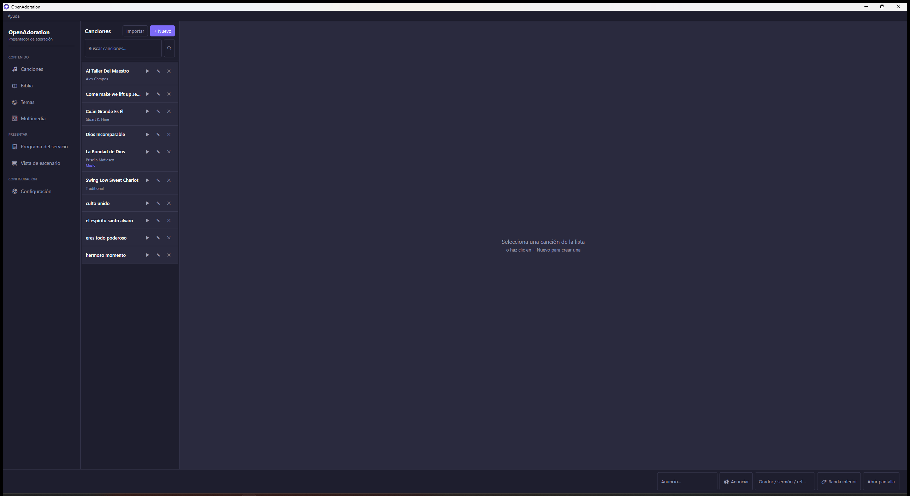

La ventana se divide en tres partes:

- **Menú lateral (izquierda):** las secciones del programa, agrupadas en **CONTENIDO**,
  **PRESENTAR** y **CONFIGURACIÓN**:
  - `🎵 Canciones`
  - `📖 Biblia`
  - `🎨 Temas` (apariencia)
  - `🖼 Multimedia`
  - `📋 Programa del servicio`
  - `📺 Vista de escenario` (monitor del operador)
  - `⚙ Configuración`
- **Área central:** la sección que tengas abierta.
- **Barra inferior (controles de proyección):** abrir/cerrar la pantalla del proyector
  (**"Abrir pantalla"** / **"Cerrar pantalla"**), anuncios (**"Anunciar"**), banda inferior
  (**"Banda inferior"**) y, cuando estás proyectando, los controles para avanzar diapositivas
  (`◀`, `▶`, **"Limpiar"**, **"Detener"**).

En el menú **"Ayuda" → "Acerca de OpenAdoration"** verás la versión y la lista de atajos de
teclado.

---

## 4. Conectar el proyector (pantalla secundaria)

1. Conecta el proyector o segundo monitor y configúralo en Windows como **"Extender"**
   (tecla `Windows + P` → "Extender").
2. En OpenAdoration, en la barra inferior haz clic en **"Abrir pantalla"** para mostrar la
   pantalla de proyección. Para ocultarla, **"Cerrar pantalla"**.
3. Si solo tienes una pantalla, la proyección se abre en una ventana flotante que puedes
   mover/redimensionar.

La pantalla del proyector también se abre automáticamente la primera vez que proyectas algo.

---

## 5. Canciones

### Crear una canción
1. Entra a `🎵 Canciones` y haz clic en **"+ Nuevo"**.
2. Escribe el **título** (obligatorio) y, si quieres, autor, clasificación, derechos de
   autor y número **CCLI**.
3. Agrega secciones con los botones **"+ Verso"**, **"+ Coro"**, **"+ Pre-coro"**,
   **"+ Puente"**, **"+ Introducción"**, **"+ Cierre"** y **"+ Coda"**. Cada sección es un
   bloque de letra que se proyecta como diapositiva.
4. Usa **▲ / ▼** para reordenar y **✕** para quitar una sección.
5. **Orden de ejecución (opcional):** escribe el orden en que se cantan las secciones usando
   fichas como `V1 C V2 C B C` (V = Verso, C = Coro, P = Pre-coro, B = Puente, I = Introducción,
   O = Cierre, T = Coda). Si lo dejas vacío, se usa el orden en que escribiste las secciones.
6. **Tema (opcional):** puedes asignarle a la canción su propio tema en el campo **"TEMA"**.
   Si lo dejas en **"Usar tema predeterminado"**, se usa el tema del servicio o de la app.
7. Haz clic en **"Guardar canción"**.

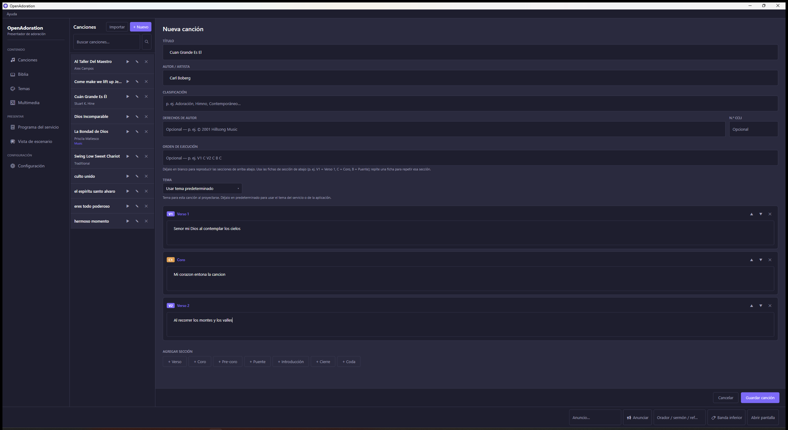

### Buscar
Escribe en **"Buscar canciones…"**: primero busca por **título/autor**; si no encuentra,
busca dentro de la **letra**.

### Importar canciones
Haz clic en **"Importar"** y elige un archivo. Formatos aceptados:
- **OpenLyrics** (`.xml`)
- **OpenSong** (`.xml` o sin extensión)
- **ChordPro** (`.cho`, `.crd`, `.chopro`, `.chordpro`) — se quitan los acordes y se queda la letra
- **VideoPsalm** (`.vpagd`) — una o varias canciones de una agenda
- **Texto plano** (`.txt`)

> En texto plano, puedes marcar secciones con líneas como `Verse 1`, `Chorus`, `V1`, `Bridge`;
> si no las pones, cada bloque separado por una línea en blanco se vuelve un verso.

### Proyectar
Haz clic en **▶** en la canción. Avanza con `Espacio`/`→` y retrocede con `←`.

---

## 6. Biblia

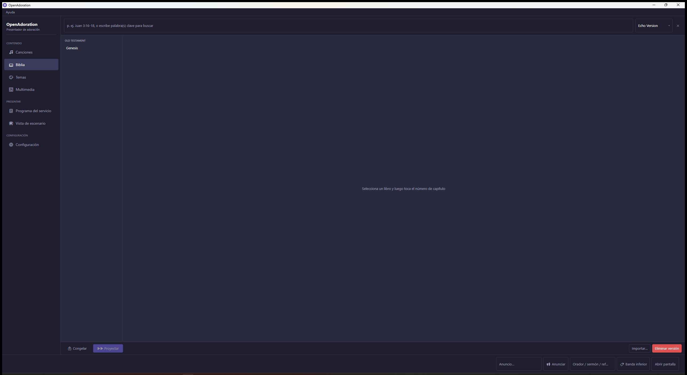

### Importar una versión
1. Entra a `📖 Biblia` y haz clic en **"Importar…"**.
2. Elige el archivo de la traducción. Se aceptan **8 formatos**: Zefania XML, OSIS XML,
   USFX XML, thiagobodruk JSON, OpenAdoration JSON y BibleSuperSearch (JSON / ZIP / SQLite).
3. Espera a que termine (puedes **cancelar** una importación larga). Al final verás cuántos
   versículos se importaron.

### Navegar y proyectar
1. Elige la **versión** arriba a la derecha.
2. Selecciona **libro → capítulo → versículo**. Al hacer clic en un versículo se **proyecta
   de inmediato**.
3. Con `←` / `→` te mueves entre los versículos del capítulo.
4. **🔒 Congelar:** mantiene la diapositiva actual en pantalla mientras buscas la siguiente
   (útil para preparar el próximo versículo sin que el público lo vea cambiar).

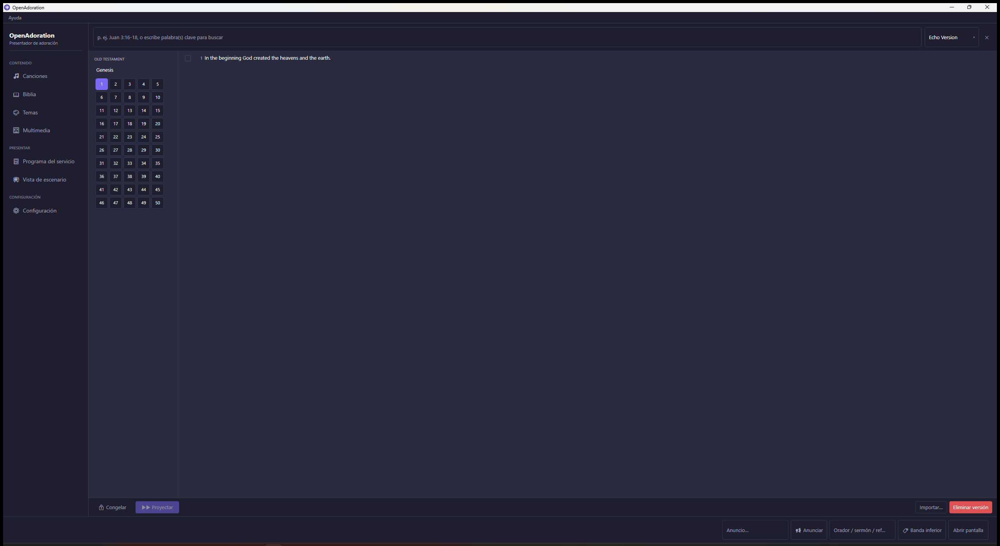

### Buscar (una sola caja inteligente)
La barra de búsqueda entiende automáticamente lo que escribes:
- **Referencia** — escribe `Juan 3:16` o `Jn 3:16-18` y salta o proyecta ese pasaje al instante.
- **Palabras clave** — escribe una o más palabras y encuentra los versículos que las contengan.
- **Frase exacta** — escribe la frase entre comillas para buscarla tal cual.

### Versículos por diapositiva
En `⚙ Configuración` puedes definir cuántos versículos se muestran por diapositiva.

> El texto de los versículos proviene de la versión que **tú** importes. Las agendas de
> VideoPsalm traen las **referencias** de la Escritura, pero no el texto (está licenciado);
> instala una versión de la Biblia para que se muestre el texto.

---

## 7. Temas (apariencia)

Un tema controla cómo se ve el texto **proyectado**: fuente, tamaño, color, alineación,
fondo y transición.

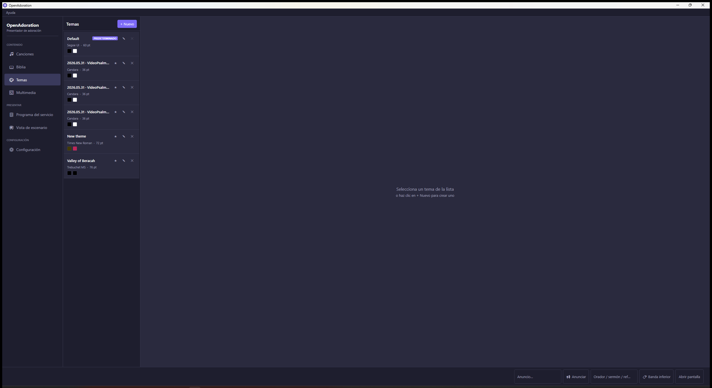

1. Entra a `🎨 Temas` y haz clic en **"+ Nuevo"**.
2. Ajusta **fuente, tamaño, color del texto y alineación** (Izquierda / Centro / Derecha).
3. **Fondo:** color sólido, **imagen** o **video** (en bucle).
4. **Transición de diapositiva:** elige cómo cambia de una diapositiva a la siguiente, o deja
   **"Usar predeterminado global"** para tomar la velocidad configurada en `⚙ Configuración`.
5. **Encabezado y pie:** texto opcional que aparece arriba y abajo de cada diapositiva. Aquí
   puedes insertar **fichas (tokens)** haciendo clic en los botones de ficha — **no las
   escribas a mano**. Las fichas se reemplazan automáticamente con la información de cada
   diapositiva:

   | Ficha | Muestra |
   |---|---|
   | `[SongTitle]` | Título de la canción |
   | `[SongAuthor]` | Autor |
   | `[SongVerseTag]` | "Verse 1", "Chorus", etc. |
   | `[SongCopyright]` | Derechos de autor |
   | `[SongCCLI]` | Número CCLI de la canción |
   | `[BibleReference]` | Referencia, p. ej. "Juan 3:16" |
   | `[BibleBookName]` | Nombre del libro |
   | `[BibleChapterID]` / `[BibleVerseID]` | Número de capítulo / versículo |
   | `[BibleDescription]` | Nombre de la versión bíblica |
   | `[ChurchName]` | Nombre de tu iglesia (de Configuración) |
   | `[SiteLicense]` | CCLI de la iglesia (de Configuración) |

   Si una ficha no aplica a la diapositiva (p. ej. una ficha bíblica en una canción), esa zona
   se oculta sola.
6. Haz clic en **"Guardar tema"**. Para que un tema sea el predeterminado de todas las
   diapositivas, usa **"Establecer como tema predeterminado"**.

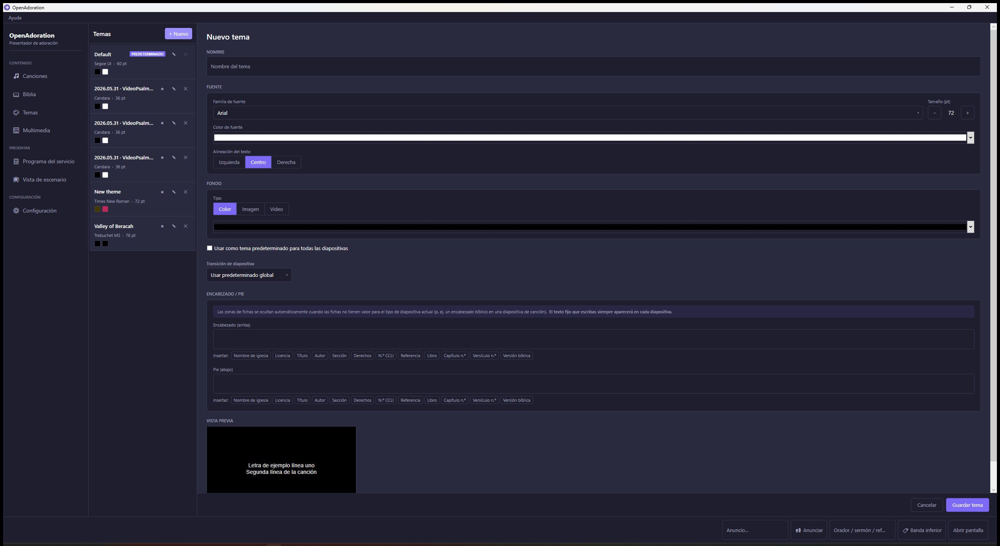

> **¿Dónde se aplica cada tema?** OpenAdoration elige el tema con esta prioridad (gana el más
> específico): el del elemento del programa → el propio de la canción → el predeterminado por
> tipo de contenido (Canciones / Escrituras / Multimedia, en Configuración) → el predeterminado
> de la app. Así una canción puede llevar su propio estilo tanto si la proyectas suelta como
> dentro de un servicio.

---

## 8. Multimedia (imágenes y videos)

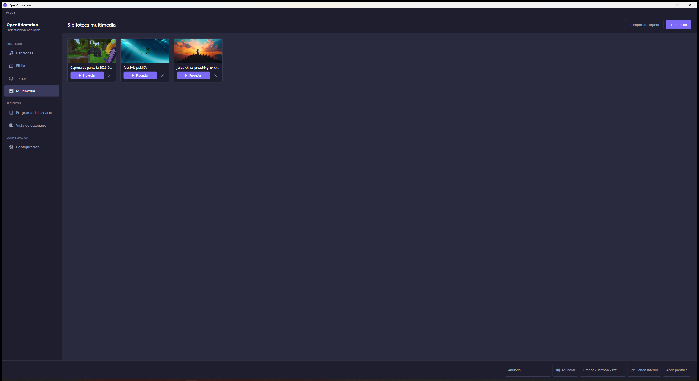

1. Entra a `🖼 Multimedia` y haz clic en **"+ Importar"** para agregar imágenes o videos, o en
   **"+ Importar carpeta"** para agregar todas las imágenes de una carpeta de una vez. El
   archivo se **copia** a la carpeta de la app (no se rompe si mueves el original).
2. Cada archivo muestra una **miniatura** (también los videos, incluidos los `.MOV` de iPhone
   en HEVC).
3. Haz clic en **proyectar** para mostrarlo a pantalla completa. Se reproduce cualquier formato
   de video, con audio.
4. Usa **eliminar** para quitarlo de la biblioteca.

> Cuando proyectas un video, la barra inferior muestra controles: **reiniciar video**,
> **retroceder 10 segundos**, **reproducir / pausar**, **avanzar 10 segundos**, una barra de
> progreso y el tiempo.

---

## 9. Programa del servicio

Arma todo el servicio por adelantado y luego solo avanza el día del culto.

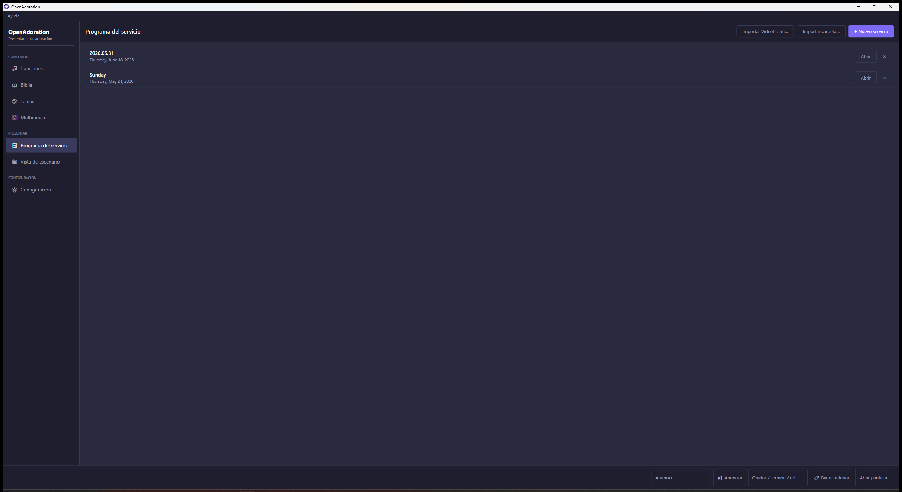

### Crear el programa
1. Entra a `📋 Programa del servicio` y haz clic en **"+ Nuevo servicio"**. Pon nombre y fecha.
2. Ábrelo y agrega elementos con **"+ Agregar canción"**, **"+ Agregar Biblia"** y
   **"+ Agregar multimedia"**.
3. **Reordena** arrastrando un elemento a su nueva posición, o con los botones **▲ / ▼**.
4. **Avance automático (`⏱`):** con los botones `[−] [⏱] [+]` defines cada cuántos segundos
   avanza solo (o lo dejas en manual).
5. **Orden personalizado (solo canciones):** en la caja de texto del elemento puedes poner un
   orden distinto solo para ese servicio (p. ej. `V1 C V2`), sin cambiar la canción original.

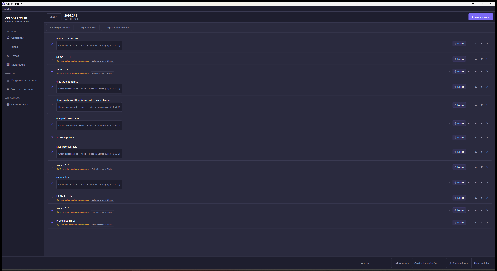

> Las Escrituras importadas desde VideoPsalm muestran **"⚠ Texto del versículo no encontrado"**
> hasta que instales una versión de la Biblia que las contenga (ver sección 6); el botón
> **"Seleccionar de la Biblia…"** te deja vincularlas a una versión instalada.

### Importar desde VideoPsalm
- **"Importar VideoPsalm…"** trae un servicio completo desde un archivo `.vpagd` (canciones,
  multimedia, orden y temas; las Escrituras entran como **referencias**).
- **"Importar carpeta…"** importa de una vez todas las agendas `.vpagd` de una carpeta,
  evitando duplicados.

### En vivo
1. Haz clic en **"▶ Iniciar servicio"** (modo en vivo).
2. Haz clic en un elemento de la lista para cargarlo, o usa **"◀ Elemento anterior"** /
   **"Elemento siguiente ▶"**.
3. Dentro de cada elemento avanza las diapositivas con `Espacio` / flechas.
4. **Cola:** con **"+ Canción"**, **"+ Biblia"** y **"+ Multimedia"** puedes agregar elementos
   sobre la marcha sin salir del modo en vivo.
5. Para terminar, **"■ Detener"**.

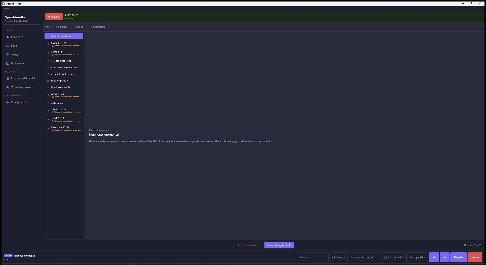

---

## 10. Vista de escenario

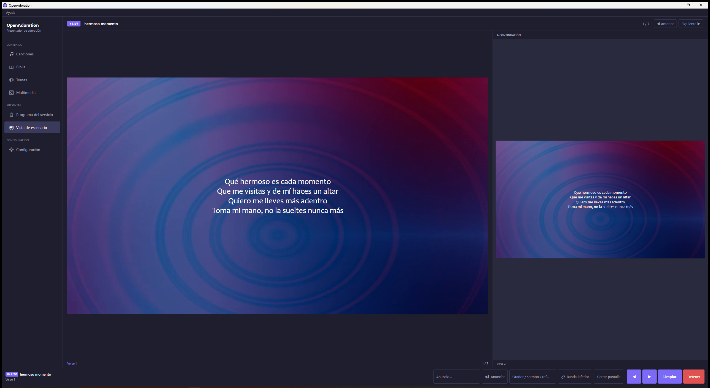

`📺 Vista de escenario` es el **monitor del operador**: muestra en grande la diapositiva
**actual** y, al lado, **"A CONTINUACIÓN"** (lo que sigue) — incluso la primera diapositiva del
**siguiente elemento** del programa cuando llegas al final del actual (verás **"Fin del
elemento"**). Es ideal para una segunda pantalla del operador o para prepararte sin mirar el
proyector.

Durante un servicio en vivo también aparecen los botones **"◀ Anterior"** / **"Siguiente ▶"**.

---

## 11. Anuncios y banda inferior

Ambos se manejan desde la barra inferior y **no cambian** la diapositiva actual.

**Anuncio** (mensaje breve que desaparece solo):
1. Escribe el texto en la caja **"Anuncio…"**.
2. Haz clic en **"📢 Anunciar"**. Aparece como una banda en la parte inferior del proyector.
3. Desaparece solo después de unos segundos (configurable), o lo quitas con **"Borrar"**.

**Banda inferior** (orador / sermón / referencia, que **permanece** entre diapositivas):
1. Escribe el texto en la caja **"Orador / sermón / ref…"**.
2. Haz clic en **"🏷 Banda inferior"**. Se mantiene visible hasta que la quites con **"Borrar"**.

---

## 12. Configuración

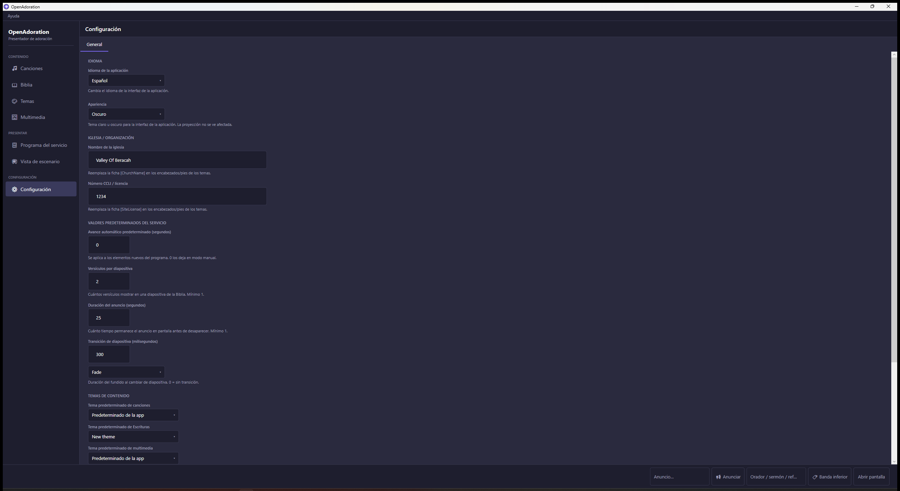

En `⚙ Configuración` puedes definir:

- **IDIOMA** — "Idioma de la aplicación" (Español / English); el cambio es inmediato.
- **Apariencia** — tema **Oscuro** o **Claro** de la interfaz de la aplicación (no afecta a la
  proyección).
- **IGLESIA / ORGANIZACIÓN** — "Nombre de la iglesia" → ficha `[ChurchName]`; "Número CCLI /
  licencia" → ficha `[SiteLicense]`.
- **VALORES PREDETERMINADOS DEL SERVICIO** — avance automático predeterminado (segundos),
  versículos por diapositiva, duración del anuncio y velocidad de transición (0 = sin animación).
- **TEMAS DE CONTENIDO** — tema predeterminado para Canciones, Escrituras y Multimedia.
- **COPIA DE SEGURIDAD** — "Crear copia…" / "Restaurar copia…" (ver sección 15).
- **ACTUALIZACIONES** — "Buscar actualizaciones…" y la opción "Buscar actualizaciones al iniciar".

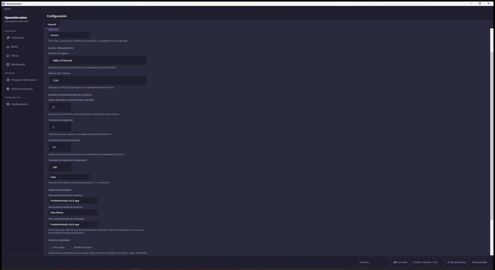

Recuerda **"Guardar"** los cambios.

---

## 13. Atajos de teclado

| Tecla | Acción |
|---|---|
| `Espacio` / `→` / `AvPág` | Siguiente diapositiva |
| `←` / `RePág` | Diapositiva anterior |
| `B` | Pantalla en negro |
| `Esc` | Detener la proyección |
| `1` – `9` | Ir a la diapositiva N |
| `Ctrl + 1` a `Ctrl + 5` | Cambiar de sección (Canciones, Biblia, Programa, Multimedia, Temas) |

---

## 14. Flujo recomendado el día del servicio

1. Abre OpenAdoration y conecta el proyector → **"Abrir pantalla"**.
2. Abre `📋 Programa del servicio`, selecciona el servicio del día y haz clic en
   **"▶ Iniciar servicio"**.
3. (Opcional) Abre `📺 Vista de escenario` en tu monitor para ver lo que sigue.
4. Avanza con `Espacio` / flechas; cambia de elemento con **"Elemento siguiente ▶"**.
5. Usa `B` o **"Limpiar"** para poner la pantalla en negro entre momentos.
6. Al terminar, `Esc` o **"■ Detener"**, y **"Cerrar pantalla"**.

---

## 15. Copia de seguridad y actualizaciones

**Copia de seguridad (recomendado):** en `⚙ Configuración` → COPIA DE SEGURIDAD usa
**"Crear copia…"** para guardar **toda** tu biblioteca (canciones, Biblias, temas, servicios y
multimedia) en un solo archivo `.oabak`. Guárdalo en una memoria USB o en la nube. Para pasarlo
a otra computadora, instala OpenAdoration allí y usa **"Restaurar copia…"** (reemplaza la
biblioteca actual y reinicia la app).

**Actualizaciones:** en `⚙ Configuración` → ACTUALIZACIONES, **"Buscar actualizaciones…"**
revisa si hay una versión más reciente y, si la hay, la descarga e instala. Es **la única vez**
que la aplicación se conecta a internet, es **opcional** y no envía ningún dato.

---

## 16. Solución de problemas

- **No veo nada en el proyector:** verifica que Windows esté en modo "Extender"
  (`Windows + P`) y que hayas pulsado **"Abrir pantalla"**.
- **El proyector muestra el escritorio en vez de la diapositiva:** vuelve a pulsar
  **"Abrir pantalla"** o proyecta un elemento.
- **La interfaz está en inglés:** `⚙ Configuración` → IDIOMA → "Idioma de la aplicación" →
  Español.
- **Una importación falló:** revisa que el archivo sea de un formato compatible. Para canciones:
  OpenLyrics, OpenSong, ChordPro, VideoPsalm o texto. Para Biblia: los 8 formatos listados.
- **Un video de iPhone (`.MOV`) no se reproduce o no muestra miniatura:** OpenAdoration usa su
  propio motor de video, así que normalmente funciona; si falla, revisa los registros (abajo).
- **Quiero respaldar mi información:** usa **"Crear copia…"** (sección 15). Como alternativa,
  puedes copiar toda la carpeta `C:\Usuarios\<tu usuario>\AppData\Local\OpenAdoration\` a una
  memoria USB.
- **Registros (logs)** para diagnóstico:
  `C:\Usuarios\<tu usuario>\AppData\Local\OpenAdoration\logs\`

---

¿Dudas o sugerencias? Abre un *issue* en el repositorio del proyecto.
OpenAdoration es software libre bajo licencia MIT.
